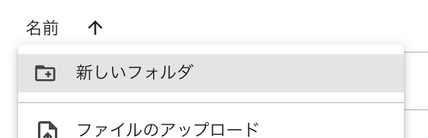
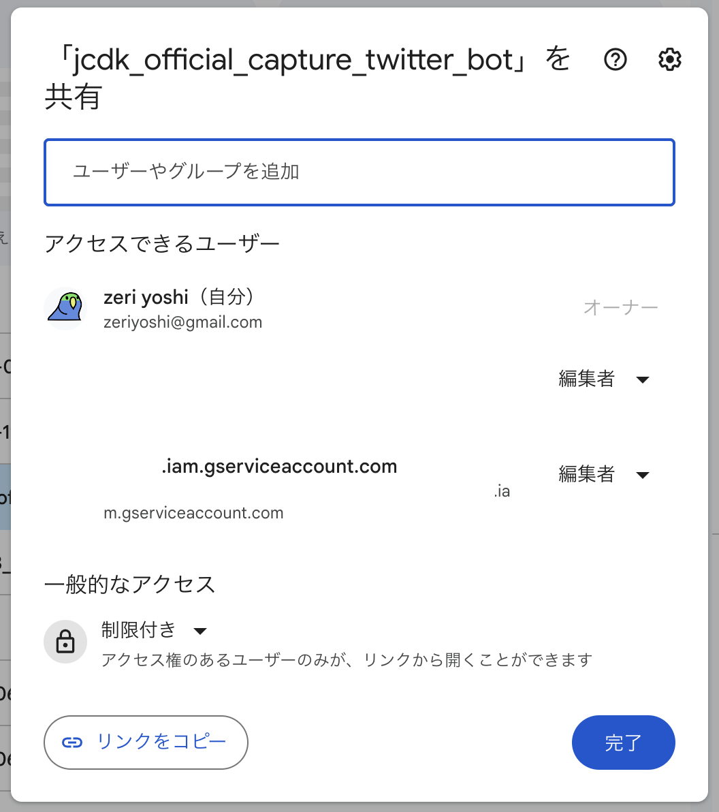

# Google Workspace

:::warning
このドキュメントはまだ完成していません
:::

[Google Workspace](https://workspace.google.co.jp/) は Google が提供するグループウェアです。

OpenJCDK では Google Drive 機能のみを利用しており、 Google Drive を用いて X にポストするメディア ファイルの管理を行います。

## Google One サブスクリプションの契約

メディア データのホスティングにはある程度の保存領域が必要となります。無料アカウントでは十分な保存領域が確保できないため、 Gogole Cloud 契約アカウントで [Google One サブスクリプション](https://one.google.com/) を契約し、保存領域を確保します。

現在、 OpenJCDK で現在利用しているプランは `Standard - 200GB` です。

## ディレクトリの作成

Google Drive を開き、権利者と共有するためのディレクトリを作成します。

## 権限の付与

作成したディレクトリの `アクセスを管理` から、メディアのアップロード・削除など管理を行うユーザーと Google Cloud のサービス アカウントを `編集者` として追加します。

