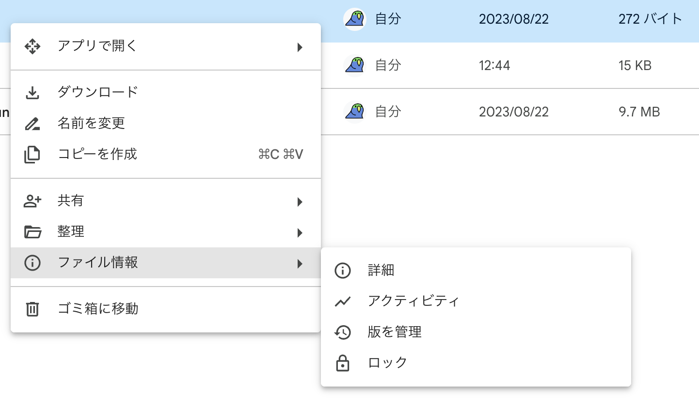
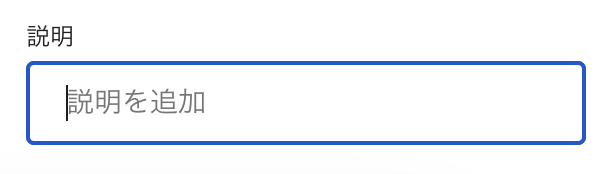
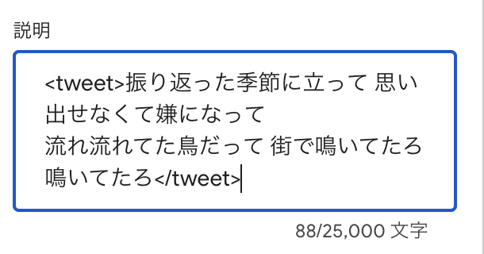
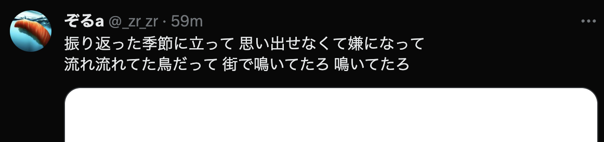
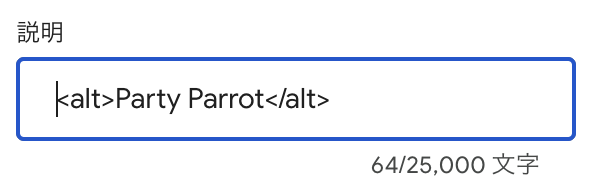
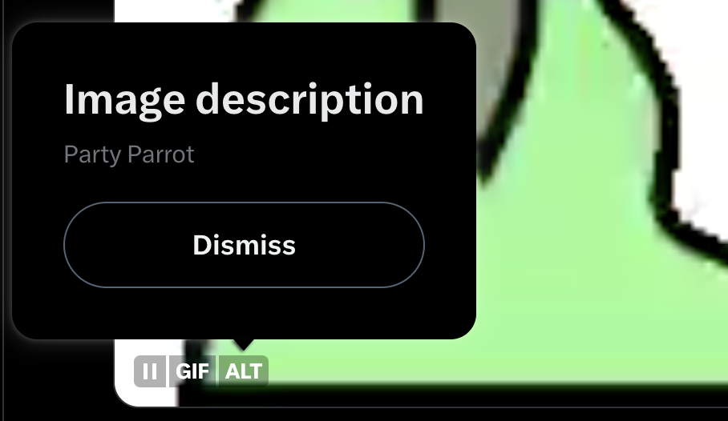

# ポストされるメディアの管理

以下の形式のメディアをアップロードできます。

- 画像 (`png`, `jpeg`, `gif`)
- 動画 (`mp4`, `mov`)

メディアの最大サイズは X の公式仕様に準拠しています。

https://developer.twitter.com/en/docs/twitter-api/v1/media/upload-media/uploading-media/media-best-practices

## メディアをアップロードする

:::warning
以下の URL は権限が付与されている人のみアクセスすることができます。
:::

投稿するメディアは以下の Google Drive にアップロードします。

https://drive.google.com/drive/u/1/folders/1dNtUKp3OrhtkntOVXRhTo2gY5Vs0pkze

大まかに、以下の要件を満たしていればほぼ問題ありません。

- 10MB 以下のファイルサイズ
- 4K または 12MP (1200 万画素) 以下の解像度

## メディアを削除する

:::warning
以下の URL は権限が付与されている人のみアクセスすることができます。
:::

以下の Google Drive からメディアを削除することで bot の投稿対象から除外することができます。

https://drive.google.com/drive/u/1/folders/1dNtUKp3OrhtkntOVXRhTo2gY5Vs0pkze

## メディアのメタデータを設定する (任意)

メディアにメタデータを設定することで、そのメディアがポストされるときの挙動をカスタマイズすることができます。

[Google Drive](https://drive.google.com/drive/u/1/folders/1dNtUKp3OrhtkntOVXRhTo2gY5Vs0pkze) を開き、メタデータを設定するファイルを選択し `ファイル情報` > `詳細` をクリックします。



右に表示されるサイドバー `詳細` タブをスクロールし、 `説明` 欄にメタデータを入力します。



:::info
`説明` を空欄にすることでメタデータを削除することができます。
:::

### 本文をカスタマイズする

`<tweet>` タグを利用することで、そのメディアが投稿されるときのポストの本文を指定することができます。

```html
<tweet>振り返った季節に立って 思い出せなくて嫌になって
流れ流れてた鳥だって 街で鳴いてたろ 鳴いてたろ</tweet>
```



結果



### 概要 (ALT) を設定する

:::warning
ALT (概要) は現在画像ファイルにのみ設定できます。これは X 側の制限事項です。
:::

`<alt>` タグを利用することで、画像ファイルの補足情報 (ALT) を設定することができます。

```html
<alt>Party Parrot</alt>
```



結果


